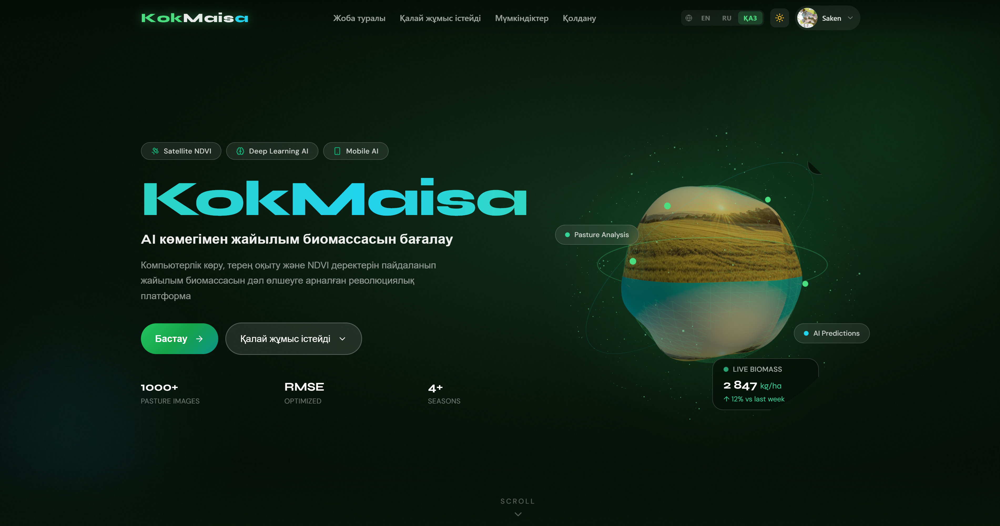
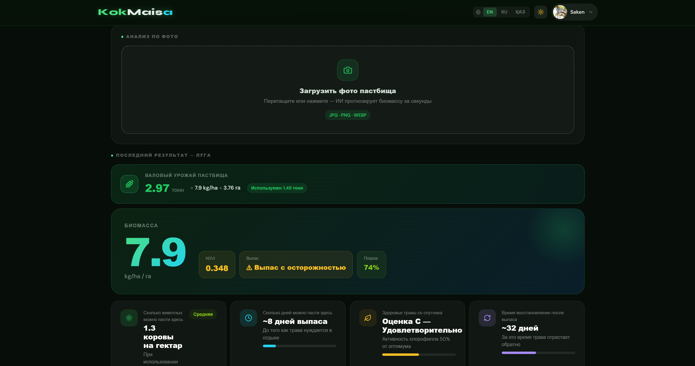
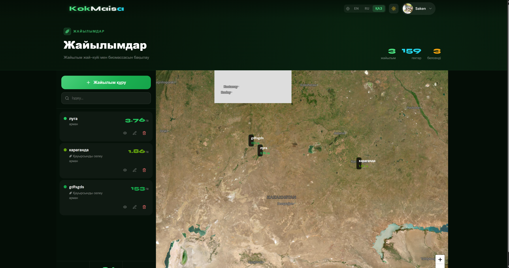
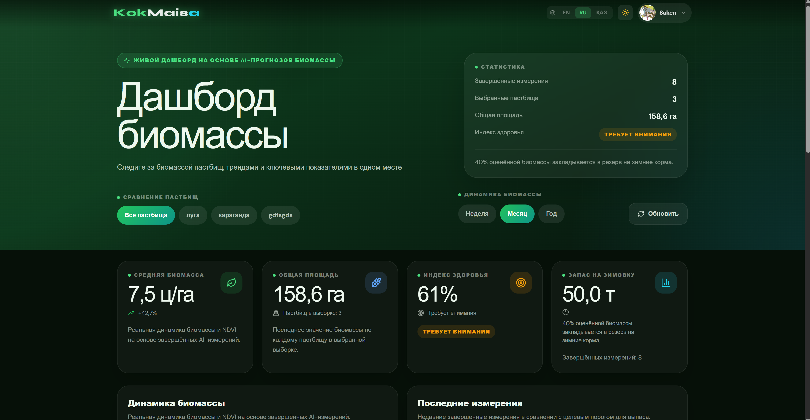
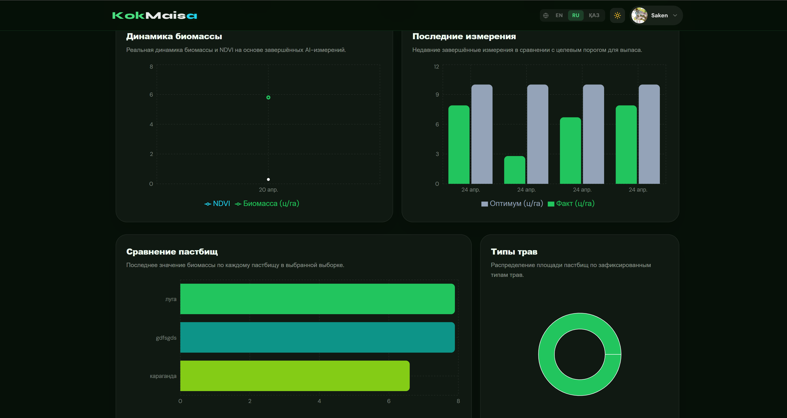
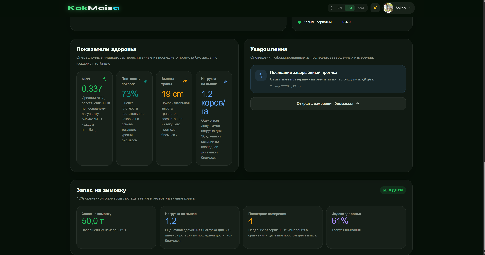
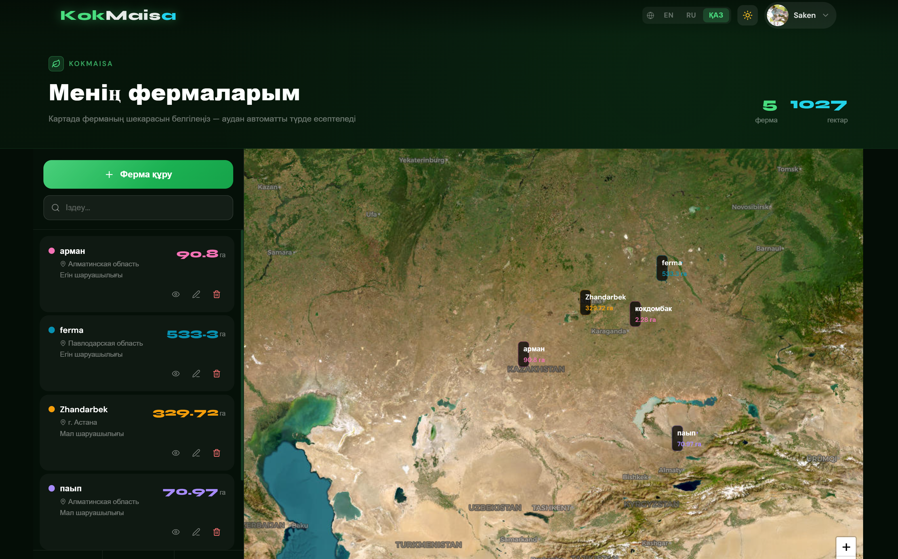

# 🌾 KokMaisa

**Интеллектуальная система управления пастбищами и анализа биомассы**

---

## 📋 Описание проекта

**KokMaisa** — это полнофункциональное веб-приложение для фермеров, позволяющее управлять пастбищами, отслеживать здоровье растений и анализировать биомассу с помощью искусственного интеллекта.

Система использует:
-  **AI-модели** для анализа изображений  (DINO-v3)
-  **Интерактивные дашборды** для визуализации данных
-  **Карты** с геолокацией пастбищ
-  **Предсказание урожая** 
-  **Мультиязычная поддержка** (русский, английский и др.)

---

##  Основной функционал

###  Для фермеров:
-  Регистрация и управление профилем
-  Добавление и управление фермами/пастбищами
-  Отметить границы пастбищ на карте
-  Управление парком беспилотников
-  Загрузка снимков с дронов для анализа
-  Просмотр детальной аналитики биомассы
-  Отслеживание тенденций и рекомендации

###  Для администраторов:
-  Управление пользователями
-  Просмотр общей статистики системы
-  Модерация контента
-  Управление моделями AI

---

##  Архитектура проекта

```
KokMaisa/
├── backend/                 # Python FastAPI приложение
│   ├── app/
│   │   ├── api/
│   │   │   ├── auth/           # Аутентификация и авторизация
│   │   │   ├── biomass/        # AI-анализ биомассы
│   │   │   ├── farms/          # Управление фермами
│   │   │   ├── pastures/       # Управление пастбищами
│   │   │   ├── drones/         # Управление дронами
│   │   │   └── measurements/   # История измерений
│   │   └── router.py           # Маршруты API
│   ├── model/
│   │   └── models.py           # SQLAlchemy модели БД
│   ├── database/
│   │   └── db.py               # Подключение к БД
│   ├── core/
│   │   ├── config.py           # Конфигурация
│   │   └── security.py         # Безопасность и JWT
│   ├── alembic/                # Миграции БД
│   ├── main.py                 # Точка входа FastAPI
│   └── requirements.txt         # Зависимости Python
│
├── frontend/                # React + Vite приложение
│   ├── src/
│   │   ├── app/
│   │   │   ├── components/
│   │   │   │   ├── Header.jsx
│   │   │   │   ├── BiomassDashboardPage.jsx    #  Главный дашборд
│   │   │   │   ├── FarmManagement.jsx
│   │   │   │   ├── PastureMap.jsx              #  Карта пастбищ
│   │   │   │   └── ui/                         # UI компоненты
│   │   │   └── pages/
│   │   ├── contexts/           # React контексты (Auth, Theme)
│   │   ├── hooks/              # Custom React hooks
│   │   ├── i18n/               # Локализация (i18next)
│   │   ├── App.jsx
│   │   └── main.jsx
│   ├── package.json
│   ├── vite.config.js
│   └── tailwind.config.js      # Tailwind CSS конфигурация
│
└── README.md
```

---

##  Быстрый старт

### Требования:
- **Python** 3.10+
- **Node.js** 18+
- **PostgreSQL** 14+ (или SQLite для разработки)

### 1. Клонирование репозитория

```bash
git clone https://github.com/yourusername/KokMaisa.git
cd KokMaisa
```

### 2. Установка Backend

```bash
cd backend

# Создание виртуального окружения
python -m venv env
source env/bin/activate  # На Windows: env\Scripts\activate

# Установка зависимостей
pip install -r requirements.txt

# Применение миграций БД
alembic upgrade head

# Загрузка ML модели (опционально)
# Установите переменные окружения:
# MODEL_PATH - путь к модели DINO-v3
# BACKBONE_NAME - название backbone модели
# MODEL_HIDDEN - размер скрытого слоя

# Запуск сервера
python main.py
```

**Сервер будет доступен по адресу:** `http://localhost:8000`

**API документация:** `http://localhost:8000/docs`

### 3. Установка Frontend

```bash
cd frontend

# Установка зависимостей
npm install

# Запуск в режиме разработки
npm run dev
```

**Приложение будет доступно по адресу:** `http://localhost:5173`

---

## 📚 Основные страницы и компоненты

### 🏠 Главная страница 


### 📊  Biomass AI



- Детальные графики роста биомассы
- Сравнение с оптимальными значениями
- Прогноз урожайности

### 🗺️ Карта управления пастбищами

- Интерактивная карта Leaflet
- Границы пастбищ с цветовой кодировкой
- Информация о каждом пастбище при клике
- Инструменты редактирования границ

### 📊 Аналитика и отчеты (Dashboard)




- Детальные графики роста биомассы
- Сравнение с оптимальными значениями
- Прогноз урожайности


### 👨‍🌾 Страница фермы



---

## 🔧 API Endpoints

### Аутентификация
```
POST   /api/auth/register        - Регистрация
POST   /api/auth/login           - Вход
POST   /api/auth/logout          - Выход
GET    /api/auth/me              - Получить текущего пользователя
POST   /api/auth/refresh         - Обновить JWT токен
```

### Фермы
```
GET    /api/farms                - Получить список ферм текущего пользователя
POST   /api/farms                - Создать новую ферму
GET    /api/farms/{id}           - Получить информацию о ферме
PUT    /api/farms/{id}           - Обновить информацию о ферме
DELETE /api/farms/{id}           - Удалить ферму
```

### Пастбища
```
GET    /api/pastures             - Получить список пастбищ
POST   /api/pastures             - Создать пастбище
GET    /api/pastures/{id}        - Получить информацию о пастбище
PUT    /api/pastures/{id}        - Обновить пастбище
DELETE /api/pastures/{id}        - Удалить пастбище
```

### Беспилотники
```
GET    /api/drones               - Список дронов
POST   /api/drones               - Добавить дрон
PUT    /api/drones/{id}          - Обновить параметры дрона
DELETE /api/drones/{id}          - Удалить дрон
```

### Анализ биомассы (AI)
```
POST   /api/measurements/photo   - Загрузить снимок и получить анализ
POST   /api/measurements/drone   - Зарегистрировать измерение с дрона
GET    /api/measurements         - История всех измерений
```

---

## 🤖 AI / Machine Learning

### Модель анализа биомассы

Система использует **DINOv3** (Self-supervised Vision Transformer) для анализа:

- **Входные данные:** RGB снимки (JPEG/PNG)
- **Выходные параметры:**
  - `biomass_value` -估 оценка биомассы (кг/га)
  - `ndvi_value` - NDVI индекс (вегетационный индекс)
  - `coverage_percent` - процент покрытия земли растениями
  - `quality_score` - оценка качества анализа (0-1)

### Использование API для анализа

```bash
curl -X POST "http://localhost:8000/api/measurements/photo" \
  -H "Authorization: Bearer YOUR_JWT_TOKEN" \
  -F "photo=@image.jpg" \
  -F "pasture_id=1"

# Ответ:
{
  "biomass_value": 2450.5,
  "ndvi_value": 0.72,
  "coverage_percent": 85.2,
  "quality_score": 0.94,
  "analysis_timestamp": "2024-04-24T10:30:00"
}
```

## 🌍 Локализация

Приложение поддерживает мультиязычность:
- 🇷🇺 Русский
- 🇬🇧 English
- 🇰🇿 Қазақ

## 📦 Используемые технологии

### Backend
| Технология | Версия | Назначение |
|-----------|--------|-----------|
| **FastAPI** | 0.104.1 | Web-фреймворк |
| **SQLAlchemy** | 2.x | ORM для БД |
| **Alembic** | 1.12.1 | Миграции БД |
| **Pydantic** | 2.x | Валидация данных |
| **OpenCV** | 4.13 | Обработка изображений |
| **NumPy** | 2.4.2 | Численные вычисления |

### Frontend
| Технология | Версия | Назначение |
|-----------|--------|-----------|
| **React** | 19.2.0 | UI фреймворк |
| **Vite** | 7.2.4 | Сборщик проекта |
| **Tailwind CSS** | 3.4.17 | Стилизация |
| **React Router** | 7.12.0 | Маршрутизация |
| **Recharts** | 3.7.0 | Графики и диаграммы |
| **Leaflet** | 1.9.4 | Интерактивные карты |
| **i18next** | 25.8.0 | Локализация |

---

## 🧪 Тестирование

### Backend тесты
```bash
cd backend
pytest tests/
pytest tests/ --cov=app  # С отчетом покрытия
```

### Frontend тесты
```bash
cd frontend
npm run test
```


## 📊 Примеры использования

### Создание фермы через API
```python
import requests

headers = {"Authorization": f"Bearer {jwt_token}"}

farm_data = {
    "name": "Ферма Олег",
    "address": "с. Чапаев, Казахстан",
    "region": "Актюбинская область",
    "area": 500.0,
    "description": "Молочная ферма с пастбищами",
    "coordinates": [
        {"lat": 51.19, "lng": 63.59},
        {"lat": 51.20, "lng": 63.59},
        {"lat": 51.20, "lng": 63.61},
    ]
}

response = requests.post(
    "http://localhost:8000/api/farms",
    json=farm_data,
    headers=headers
)

print(response.json())
```

### Загрузка и анализ изображения
```python
files = {"photo": open("drone_image.jpg", "rb")}
data = {"pasture_id": 1}

response = requests.post(
    "http://localhost:8000/api/measurements/photo",
    files=files,
    data=data,
    headers=headers
)

analysis = response.json()
print(f"Биомасса: {analysis['biomass_value']} кг/га")
print(f"NDVI: {analysis['ndvi_value']}")
```

---

## 🚀 Развертывание

### Docker

```bash
# Создание образов
docker-compose build

# Запуск контейнеров
docker-compose up -d

# Применение миграций
docker-compose exec backend alembic upgrade head

# Просмотр логов
docker-compose logs -f backend
```

### Production

```bash
# Backend
pip install gunicorn
gunicorn main:app -w 4 -b 0.0.0.0:8000

# Frontend
npm run build
# Сгенерированные файлы в dist/ загрузить на Nginx/Apache
```

---

## 📱 Функции мобильной версии

- 📸 Быстрая загрузка фото с камеры телефона
- 📍 Геолокация для определения координат
- 🔔 Push-уведомления об алертах
- 📊 Мини-версия дашборда для мобильных устройств

---


## 🐛 Известные проблемы

- [ ] Оптимизация загрузки больших снимков (>10MB)
- [ ] Кэширование данных на фронтенде
- [ ] Экспорт отчетов в PDF

---

## 📌 Дорожная карта

### Q2 2026
- [ ] Интеграция с API спутниковых снимков (Sentinel-2)
- [ ] Экспорт отчетов PDF
- [ ] Mobile приложение (React Native)

### Q3 2026
- [ ] Многоязычная поддержка (添加 китайский, корейский)
- [ ] Integration с IoT сенсорами влажности почвы
- [ ] Рекомендации по орошению через ML

### Q4 2026
- [ ] Marketplace для обмена лучшими практиками между фермерами
- [ ] Video-аналитика с дронов в реальном времени

---

**Спасибо за использование KokMaisa! 🌾**

